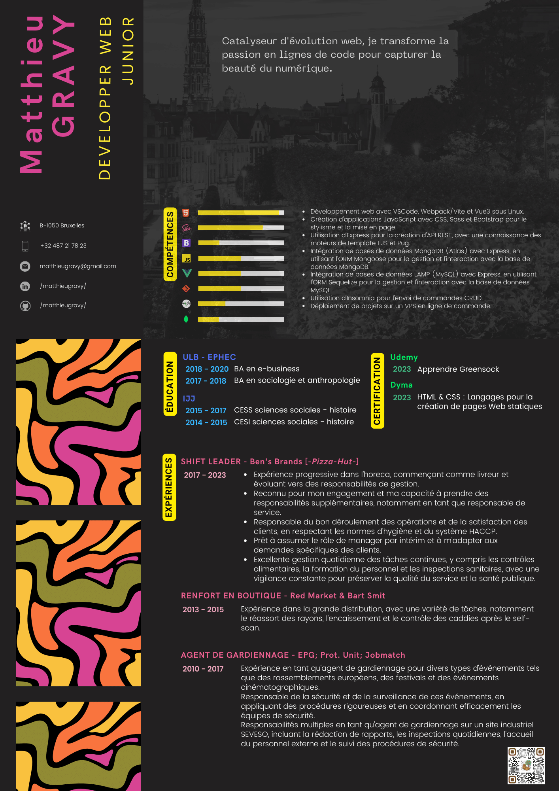

# matthieu-gravy-cv

This CV is currently based on an adaptation of an existing template. The template I had used on Canva didn't fit perfectly for an online version. Nevertheless, I encountered some issues that slowed me down.

**Initial Deployment:** Initially, I wasn't using Vite for streamlined deployment. Instead, I used the `npm run build` command, exported the result to a new directory, and then published it.

**Broken Links:** After deployment, I noticed that links to other style and image files were broken.

**Scripts in the head:** Additionally, I initially placed scripts in the `<head>` section of the document, which also caused issues.

However, I am actively working to address these problems to enhance the overall experience of my online CV.

## sources

